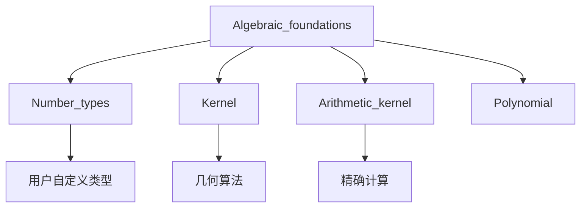
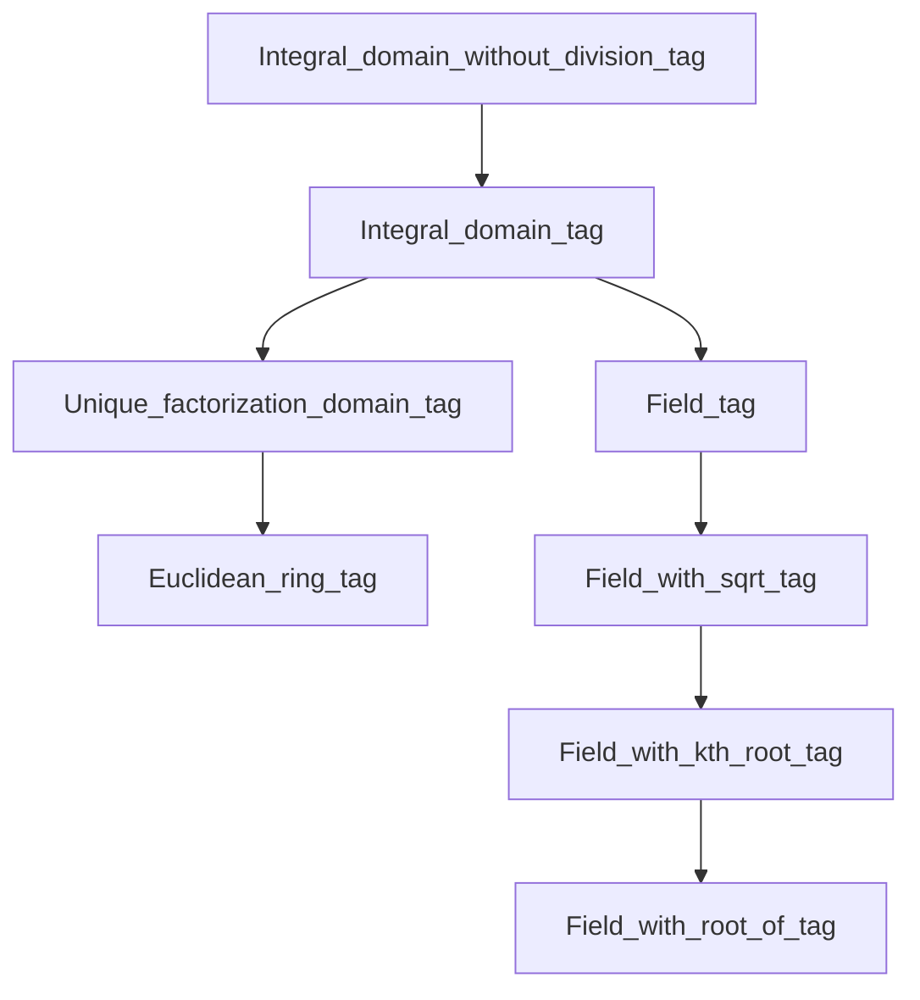
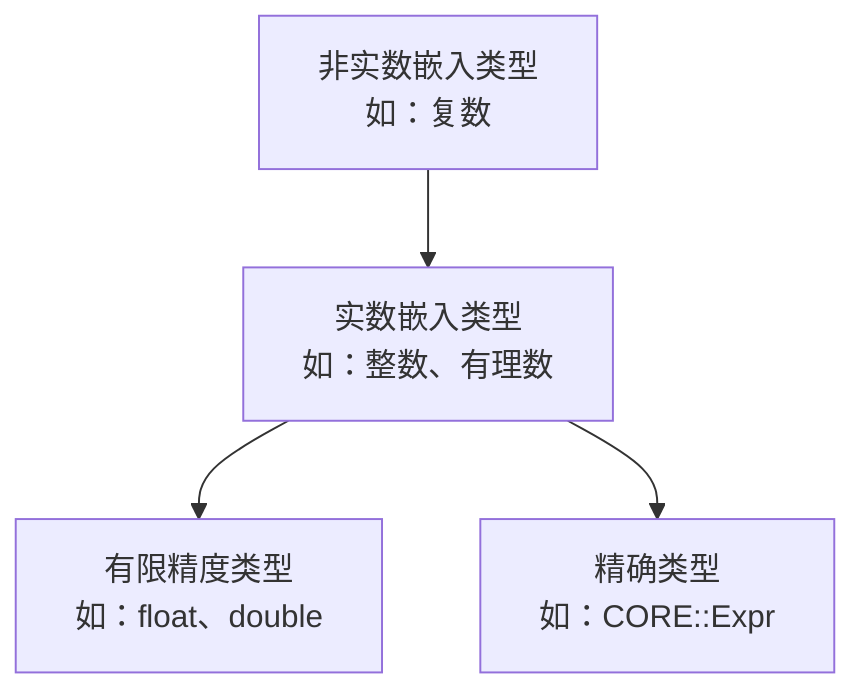

# CGAL Algebraic_foundations 模块技术文档 v2.0

## 目录

1. [执行摘要](#1-执行摘要)
2. [模块概述](#2-模块概述)
3. [架构设计](#3-架构设计)
4. [核心概念](#4-核心概念)
5. [代数结构层次体系](#5-代数结构层次体系)
6. [主要特性类详解](#6-主要特性类详解)
7. [类型强制转换机制](#7-类型强制转换机制)
8. [实数嵌入特性](#8-实数嵌入特性)
9. [数值工具函数](#9-数值工具函数)
10. [高级特性](#10-高级特性)
11. [使用指南](#11-使用指南)
12. [性能优化](#12-性能优化)
13. [最佳实践](#13-最佳实践)
14. [API参考](#14-api参考)
15. [附录](#15-附录)

---

## 1. 执行摘要

### 1.1 模块定位

CGAL Algebraic_foundations模块是整个CGAL库的数值基础设施，提供了一套完整的数值类型抽象层。该模块通过特性类（Traits）机制，实现了对不同数值类型的统一访问接口，使得CGAL的算法能够以泛型方式处理各种数值类型。

### 1.2 核心价值

- **类型安全性**：通过编译时类型检查确保数值操作的正确性
- **性能优化**：零开销抽象，通过模板特化避免运行时开销
- **可扩展性**：轻松添加新的数值类型支持
- **互操作性**：不同数值类型之间的自动转换和操作

### 1.3 技术亮点

- 基于C++模板元编程的特性类设计
- 层次化的代数结构分类系统
- 智能的类型强制转换机制
- 完善的数学函数适配器

---

## 2. 模块概述

### 2.1 设计理念

Algebraic_foundations模块的设计理念基于以下核心原则：

#### 2.1.1 分离关注点
- **结构特性**：描述数值类型的代数结构（域、环、整域等）
- **嵌入特性**：描述数值类型在实数系统中的性质
- **转换特性**：处理不同类型之间的转换关系

#### 2.1.2 编译时多态
通过模板特化和标签分派技术，在编译时确定具体的实现，避免虚函数调用开销。

#### 2.1.3 渐进式接口
从基本功能到高级功能逐层提供，用户可以根据需求选择合适的抽象层次。

### 2.2 模块组成

```
Algebraic_foundations/
├── include/CGAL/
│   ├── Algebraic_structure_traits.h    # 代数结构特性
│   ├── Real_embeddable_traits.h        # 实数嵌入特性
│   ├── Coercion_traits.h               # 类型强制转换
│   ├── Fraction_traits.h               # 分数特性
│   ├── Chinese_remainder_traits.h      # 中国剩余定理
│   ├── Scalar_factor_traits.h          # 标量因子
│   ├── number_utils.h                  # 数值工具函数
│   └── extended_euclidean_algorithm.h  # 扩展欧几里德算法
├── examples/                            # 示例代码
├── test/                                # 单元测试
└── doc/                                 # 文档
```

### 2.3 与其他模块的关系



---

## 3. 架构设计

### 3.1 整体架构

Algebraic_foundations采用分层架构设计，每一层提供特定的功能抽象：

```
┌─────────────────────────────────────┐
│        应用层（CGAL算法）           │
├─────────────────────────────────────┤
│        适配器层（Functors）         │
├─────────────────────────────────────┤
│      特性类层（Traits Classes）     │
├─────────────────────────────────────┤
│     标签系统层（Tag System）        │
├─────────────────────────────────────┤
│      基础类型层（Basic Types）      │
└─────────────────────────────────────┘
```

### 3.2 设计模式应用

#### 3.2.1 特性类模式（Traits Pattern）
```cpp
template<class Type>
class Algebraic_structure_traits {
    typedef Type_ Type;
    typedef /* tag */ Algebraic_category;
    // 函子定义...
};
```

#### 3.2.2 标签分派（Tag Dispatching）
```cpp
template<class NT>
NT unit_part(const NT& x) {
    typedef typename Algebraic_structure_traits<NT>::Algebraic_category Tag;
    return unit_part_impl(x, Tag());
}
```

#### 3.2.3 CRTP（Curiously Recurring Template Pattern）
用于实现静态多态和代码复用。

### 3.3 编译时决策机制

通过SFINAE（Substitution Failure Is Not An Error）和模板特化实现编译时的类型检查和函数选择：

```cpp
template<class T>
typename std::enable_if<
    std::is_same<
        typename Algebraic_structure_traits<T>::Algebraic_category,
        Field_tag
    >::value,
    T
>::type
inverse(const T& x) {
    // Field特定实现
}
```

---

## 4. 核心概念

### 4.1 代数结构（Algebraic Structure）

代数结构描述了数值类型支持的数学运算及其性质。CGAL定义了以下核心代数结构概念：

#### 4.1.1 整域无除法（IntegralDomainWithoutDivision）
- **定义**：支持加法、减法和乘法的交换环，无零因子
- **要求**：`+`, `-`, `*` 操作，且 `a*b = 0` 则 `a = 0` 或 `b = 0`
- **示例**：多项式环

#### 4.1.2 整域（IntegralDomain）
- **定义**：整域无除法 + 整除操作
- **新增**：`integral_division` 函子
- **示例**：整数环 Z

#### 4.1.3 唯一分解域（UniqueFactorizationDomain）
- **定义**：每个非零元素可唯一分解为素元素的乘积
- **新增**：`gcd` 函子
- **示例**：整数环、多项式环

#### 4.1.4 欧几里德环（EuclideanRing）
- **定义**：支持欧几里德除法的整域
- **新增**：`div`, `mod`, `div_mod` 函子
- **示例**：整数、高斯整数

#### 4.1.5 域（Field）
- **定义**：每个非零元素都有乘法逆元
- **新增**：`inverse` 函子
- **示例**：有理数、实数、复数

### 4.2 实数嵌入（Real Embeddable）

实数嵌入特性描述了类型在实数轴上的性质：

```cpp
template<class Type>
class Real_embeddable_traits {
    typedef /* true/false */ Is_real_embeddable;
    
    // 符号和比较
    class Sgn;      // 符号函数
    class Abs;      // 绝对值
    class Compare;  // 比较函数
    
    // 转换
    class To_double;    // 转换为double
    class To_interval;  // 转换为区间
};
```

### 4.3 类型强制转换（Coercion）

处理不同数值类型之间的隐式和显式转换：

```cpp
template<class A, class B>
struct Coercion_traits {
    typedef /* true/false */ Are_explicit_interoperable;
    typedef /* true/false */ Are_implicit_interoperable;
    typedef /* common type */ Type;
    
    struct Cast {
        Type operator()(const A& a);
        Type operator()(const B& b);
    };
};
```

---

## 5. 代数结构层次体系

### 5.1 标签继承关系

```cpp
// 基础标签
struct Integral_domain_without_division_tag {};

// 整域标签继承自无除法整域
struct Integral_domain_tag 
    : public Integral_domain_without_division_tag {};

// 唯一分解域继承自整域
struct Unique_factorization_domain_tag 
    : public Integral_domain_tag {};

// 欧几里德环继承自唯一分解域
struct Euclidean_ring_tag 
    : public Unique_factorization_domain_tag {};

// 域继承自整域（不同分支）
struct Field_tag 
    : public Integral_domain_tag {};

// 带平方根的域
struct Field_with_sqrt_tag 
    : public Field_tag {};

// 带k次根的域
struct Field_with_kth_root_tag 
    : public Field_with_sqrt_tag {};

// 带根式的域
struct Field_with_root_of_tag 
    : public Field_with_kth_root_tag {};
```

### 5.2 标签层次图



### 5.3 函子可用性矩阵

| 函子 | 整域无除法 | 整域 | UFD | 欧几里德环 | 域 |
|------|-----------|------|-----|-----------|-----|
| Unit_part | ✓ | ✓ | ✓ | ✓ | ✓ |
| Square | ✓ | ✓ | ✓ | ✓ | ✓ |
| Is_zero | ✓ | ✓ | ✓ | ✓ | ✓ |
| Is_one | ✓ | ✓ | ✓ | ✓ | ✓ |
| Integral_division | ✗ | ✓ | ✓ | ✓ | ✓ |
| Gcd | ✗ | ✗ | ✓ | ✓ | ✗ |
| Div/Mod | ✗ | ✗ | ✗ | ✓ | ✗ |
| Inverse | ✗ | ✗ | ✗ | ✗ | ✓ |
| Sqrt | ✗ | ✗ | ✗ | ✗ | 部分 |

---

## 6. 主要特性类详解

### 6.1 Algebraic_structure_traits

#### 6.1.1 类定义
```cpp
template<class Type>
class Algebraic_structure_traits {
public:
    // 类型定义
    typedef Type Type;
    typedef /* tag */ Algebraic_category;
    typedef /* true/false */ Is_exact;
    typedef /* true/false */ Is_numerical_sensitive;
    
    // 基础函子
    class Simplify;         // 简化
    class Unit_part;        // 单位部分
    class Integral_division;// 整除
    class Is_square;        // 是否为平方数
    
    // UFD函子
    class Gcd;              // 最大公约数
    class Divides;          // 整除判断
    
    // 欧几里德环函子
    class Div;              // 除法
    class Mod;              // 取模
    class Div_mod;          // 同时除法和取模
    
    // 域函子
    class Inverse;          // 乘法逆元
    
    // 扩展函子
    class Sqrt;             // 平方根
    class Kth_root;         // k次根
    class Root_of;          // 多项式根
};
```

#### 6.1.2 Unit_part函子详解

Unit_part返回一个数的单位部分，其定义依赖于代数结构：

```cpp
// 对于整域（如整数）
template<class Type>
class Unit_part {
    Type operator()(const Type& x) const {
        if (x < 0) return Type(-1);
        else return Type(1);
    }
};

// 对于域（如有理数）
template<class Type>
class Unit_part {
    Type operator()(const Type& x) const {
        if (x == 0) return Type(1);
        else return x;  // 非零元素都是单位
    }
};
```

#### 6.1.3 Gcd函子实现

最大公约数的计算使用欧几里德算法：

```cpp
class Gcd {
    Type operator()(const Type& x, const Type& y) const {
        // 处理特殊情况
        if (x == 0) {
            if (y == 0) return Type(0);
            return integral_div(y, unit_part(y));
        }
        if (y == 0) {
            return integral_div(x, unit_part(x));
        }
        
        // 欧几里德算法主循环
        Type u = integral_div(x, unit_part(x));
        Type v = integral_div(y, unit_part(y));
        
        while (v != 0) {
            Type r = mod(u, v);
            u = v;
            v = r;
        }
        return u;
    }
};
```

### 6.2 Real_embeddable_traits

#### 6.2.1 类定义
```cpp
template<class Type>
class Real_embeddable_traits {
public:
    typedef Type Type;
    typedef /* true/false */ Is_real_embeddable;
    typedef bool Boolean;
    typedef CGAL::Sign Sign;
    typedef CGAL::Comparison_result Comparison_result;
    
    // 符号和比较函子
    class Abs;          // 绝对值
    class Sgn;          // 符号函数
    class Is_positive;  // 是否为正
    class Is_negative;  // 是否为负
    class Is_zero;      // 是否为零
    class Compare;      // 比较
    
    // 有限性检查
    class Is_finite;    // 是否有限
    
    // 转换函子
    class To_double;    // 转换为double
    class To_interval;  // 转换为区间
};
```

#### 6.2.2 符号函数实现
```cpp
class Sgn {
    Sign operator()(const Type& x) const {
        if (x < Type(0)) return NEGATIVE;
        if (x > Type(0)) return POSITIVE;
        return ZERO;
    }
};
```

#### 6.2.3 区间转换
```cpp
class To_interval {
    std::pair<double, double> operator()(const Type& x) const {
        double d = static_cast<double>(x);
        // 考虑舍入误差
        return std::make_pair(
            std::nextafter(d, -INFINITY),
            std::nextafter(d, +INFINITY)
        );
    }
};
```

### 6.3 Coercion_traits

#### 6.3.1 设计目标

Coercion_traits解决了以下问题：
- 不同数值类型之间的二元操作
- 自动类型提升
- 避免精度损失
- 编译时类型检查

#### 6.3.2 实现机制

```cpp
template<class A, class B>
struct Coercion_traits {
    // 标记是否可以互操作
    typedef Tag_true Are_explicit_interoperable;
    typedef Tag_false Are_implicit_interoperable;
    
    // 公共类型
    typedef /* common type */ Type;
    
    // 转换函子
    struct Cast {
        Type operator()(const A& a) const;
        Type operator()(const B& b) const;
    };
};
```

#### 6.3.3 内置类型特化

```cpp
// int -> double的特化
template<>
struct Coercion_traits<int, double> {
    typedef Tag_true Are_explicit_interoperable;
    typedef Tag_true Are_implicit_interoperable;
    typedef double Type;
    
    struct Cast {
        double operator()(int x) const { return double(x); }
        double operator()(double x) const { return x; }
    };
};
```

#### 6.3.4 使用示例

```cpp
template<class A, class B>
typename Coercion_traits<A, B>::Type
multiply(const A& a, const B& b) {
    typedef Coercion_traits<A, B> CT;
    static_assert(CT::Are_explicit_interoperable::value);
    
    typename CT::Cast cast;
    return cast(a) * cast(b);
}
```

---

## 7. 类型强制转换机制

### 7.1 转换层次

CGAL定义了三个层次的类型互操作性：

#### 7.1.1 无互操作性
两个类型完全不兼容，不能进行任何形式的转换。

#### 7.1.2 显式互操作性（Explicit Interoperability）
- 需要显式转换
- 通过Cast函子实现
- 编译时类型安全

#### 7.1.3 隐式互操作性（Implicit Interoperability）
- 支持隐式转换
- 可直接进行二元操作
- 如：int和double

### 7.2 转换矩阵

| 类型A | 类型B | 公共类型 | 互操作性 |
|-------|-------|---------|---------|
| int | int | int | 隐式 |
| int | long | long | 隐式 |
| int | double | double | 隐式 |
| int | Rational | Rational | 显式 |
| Rational | double | double | 显式 |
| Polynomial<int> | int | Polynomial<int> | 显式 |

### 7.3 高级应用

#### 7.3.1 二元函数适配器

```cpp
#define CGAL_IMPLICIT_INTEROPERABLE_BINARY_OPERATOR(NT) \
template<class T1, class T2> \
NT operator()(const T1& x, const T2& y) const { \
    typedef Coercion_traits<T1, T2> CT; \
    static_assert(std::is_same<typename CT::Type, NT>::value); \
    typename CT::Cast cast; \
    return operator()(cast(x), cast(y)); \
}
```

#### 7.3.2 迭代器转换

```cpp
template<class InputIterator, class OutputType>
class Cast_iterator {
    typedef Coercion_traits<
        typename std::iterator_traits<InputIterator>::value_type,
        OutputType
    > CT;
    
    typename CT::Cast cast;
    
public:
    OutputType operator*() const {
        return cast(*base_iterator);
    }
};
```

---

## 8. 实数嵌入特性

### 8.1 概念定义

实数嵌入特性描述了一个数值类型如何映射到实数轴上：

```cpp
concept RealEmbeddable {
    // 类型可以与实数比较
    bool operator<(const T&, const T&);
    bool operator>(const T&, const T&);
    bool operator==(const T&, const T&);
    
    // 具有符号概念
    Sign sign(const T&);
    
    // 可以取绝对值
    T abs(const T&);
};
```

### 8.2 符号系统

```cpp
enum Sign {
    NEGATIVE = -1,
    ZERO = 0,
    POSITIVE = 1
};

enum Comparison_result {
    SMALLER = -1,
    EQUAL = 0,
    LARGER = 1
};
```

### 8.3 实数嵌入层次



### 8.4 应用场景

#### 8.4.1 几何谓词
```cpp
template<class NT>
Sign orientation_2d(const NT& ax, const NT& ay,
                   const NT& bx, const NT& by,
                   const NT& cx, const NT& cy) {
    typedef Real_embeddable_traits<NT> RET;
    typename RET::Sgn sgn;
    
    NT det = (bx-ax)*(cy-ay) - (by-ay)*(cx-ax);
    return sgn(det);
}
```

#### 8.4.2 区间算术
```cpp
template<class NT>
std::pair<double, double> to_interval(const NT& x) {
    typedef Real_embeddable_traits<NT> RET;
    typename RET::To_interval to_interval;
    return to_interval(x);
}
```

---

## 9. 数值工具函数

### 9.1 基础算术函数

#### 9.1.1 符号和绝对值
```cpp
// 获取符号
template<class NT>
Sign sign(const NT& x) {
    typename Real_embeddable_traits<NT>::Sgn sgn;
    return sgn(x);
}

// 绝对值
template<class NT>
NT abs(const NT& x) {
    typename Real_embeddable_traits<NT>::Abs abs_functor;
    return abs_functor(x);
}
```

#### 9.1.2 比较函数
```cpp
// 比较两个数
template<class NT>
Comparison_result compare(const NT& x, const NT& y) {
    typename Real_embeddable_traits<NT>::Compare cmp;
    return cmp(x, y);
}

// 判断是否为零
template<class NT>
bool is_zero(const NT& x) {
    typename Real_embeddable_traits<NT>::Is_zero is_zero;
    return is_zero(x);
}
```

### 9.2 代数运算函数

#### 9.2.1 最大公约数和最小公倍数
```cpp
// 最大公约数
template<class NT>
NT gcd(const NT& x, const NT& y) {
    typename Algebraic_structure_traits<NT>::Gcd gcd_functor;
    return gcd_functor(x, y);
}

// 最小公倍数
template<class NT>
NT lcm(const NT& x, const NT& y) {
    if (is_zero(x) || is_zero(y)) return NT(0);
    return abs(x * y) / gcd(x, y);
}
```

#### 9.2.2 整除和取模
```cpp
// 整除
template<class NT>
NT div(const NT& x, const NT& y) {
    typename Algebraic_structure_traits<NT>::Div div_functor;
    return div_functor(x, y);
}

// 取模
template<class NT>
NT mod(const NT& x, const NT& y) {
    typename Algebraic_structure_traits<NT>::Mod mod_functor;
    return mod_functor(x, y);
}

// 同时计算商和余数
template<class NT>
void div_mod(const NT& x, const NT& y, NT& q, NT& r) {
    typename Algebraic_structure_traits<NT>::Div_mod dm;
    dm(x, y, q, r);
}
```

### 9.3 扩展算术函数

#### 9.3.1 幂运算
```cpp
// 整数幂
template<class NT>
NT ipower(const NT& base, int exp) {
    if (exp == 0) return NT(1);
    if (exp < 0) {
        typename Algebraic_structure_traits<NT>::Inverse inv;
        return ipower(inv(base), -exp);
    }
    
    NT result = NT(1);
    NT power = base;
    while (exp > 0) {
        if (exp & 1) result *= power;
        power *= power;
        exp >>= 1;
    }
    return result;
}
```

#### 9.3.2 根运算
```cpp
// 平方根
template<class NT>
NT sqrt(const NT& x) {
    typename Algebraic_structure_traits<NT>::Sqrt sqrt_functor;
    return sqrt_functor(x);
}

// k次根
template<class NT>
NT kth_root(int k, const NT& x) {
    typename Algebraic_structure_traits<NT>::Kth_root kth_root_functor;
    return kth_root_functor(k, x);
}
```

### 9.4 特殊算法

#### 9.4.1 扩展欧几里德算法
```cpp
template<class NT>
NT extended_euclidean_algorithm(const NT& a, const NT& b,
                               NT& s, NT& t) {
    // 初始化
    NT old_r = a, r = b;
    NT old_s = 1, s_temp = 0;
    NT old_t = 0, t_temp = 1;
    
    while (r != 0) {
        NT quotient = old_r / r;
        
        NT temp = r;
        r = old_r - quotient * r;
        old_r = temp;
        
        temp = s_temp;
        s_temp = old_s - quotient * s_temp;
        old_s = temp;
        
        temp = t_temp;
        t_temp = old_t - quotient * t_temp;
        old_t = temp;
    }
    
    s = old_s;
    t = old_t;
    return old_r;  // gcd(a, b)
}
```

#### 9.4.2 中国剩余定理
```cpp
template<class NT>
void chinese_remainder(
    const NT& m1, const NT& u1,  // u1 (mod m1)
    const NT& m2, const NT& u2,  // u2 (mod m2)
    NT& m, NT& u)                // u (mod m)
{
    typedef Chinese_remainder_traits<NT> CRT;
    typename CRT::Chinese_remainder cr;
    cr(m1, u1, m2, u2, m, u);
}
```

---

## 10. 高级特性

### 10.1 分数特性（Fraction_traits）

#### 10.1.1 概念定义
```cpp
template<class Type>
class Fraction_traits {
    typedef Type Type;
    typedef /* true/false */ Is_fraction;
    typedef /* numerator type */ Numerator_type;
    typedef /* denominator type */ Denominator_type;
    
    // 分解为分子分母
    class Decompose {
        void operator()(const Type& f,
                       Numerator_type& num,
                       Denominator_type& den);
    };
    
    // 从分子分母构造
    class Compose {
        Type operator()(const Numerator_type& num,
                       const Denominator_type& den);
    };
    
    // 获取公因子
    class Common_factor {
        Denominator_type operator()(const Type& f);
    };
};
```

#### 10.1.2 应用示例
```cpp
// 有理数分解
typedef Fraction_traits<Rational> FT;
FT::Numerator_type num;
FT::Denominator_type den;

Rational r(3, 7);
FT::Decompose()(r, num, den);
// num = 3, den = 7

// 重新组合
Rational r2 = FT::Compose()(num * 2, den);
// r2 = 6/7
```

### 10.2 标量因子特性（Scalar_factor_traits）

#### 10.2.1 概念定义
```cpp
template<class Type>
class Scalar_factor_traits {
    typedef Type Type;
    typedef /* scalar type */ Scalar;
    
    // 提取标量因子
    class Scalar_factor {
        Scalar operator()(const Type& x);
        Scalar operator()(const Type& x, const Scalar& d);
    };
    
    // 标量除法
    class Scalar_div {
        Type operator()(const Type& x, const Scalar& s);
    };
};
```

#### 10.2.2 多项式应用
```cpp
// 提取多项式的公因子
Polynomial<int> p = 6*x^2 + 9*x + 3;
typedef Scalar_factor_traits<Polynomial<int>> SFT;
int factor = SFT::Scalar_factor()(p);  // factor = 3

Polynomial<int> reduced = SFT::Scalar_div()(p, factor);
// reduced = 2*x^2 + 3*x + 1
```

### 10.3 代数扩展特性（Algebraic_extension_traits）

#### 10.3.1 用途
处理代数扩展域，如 Q[√2] 或 Q[³√5]。

#### 10.3.2 主要功能
- 判断元素是否在基域中
- 分解为基域元素的线性组合
- 规范化表示

### 10.4 需要括号特性（Needs_parens_as_product）

#### 10.4.1 用途
用于输出表达式时判断是否需要括号。

```cpp
template<class NT>
struct Needs_parens_as_product {
    bool operator()(const NT& x);
};

// 示例
Needs_parens_as_product<Polynomial<int>> npp;
Polynomial<int> p = x + 1;
if (npp(p)) {
    cout << "(" << p << ")";  // 输出 (x+1)
} else {
    cout << p;
}
```

---

## 11. 使用指南

### 11.1 为自定义类型添加支持

#### 11.1.1 步骤概览
1. 确定类型的代数结构
2. 特化Algebraic_structure_traits
3. 特化Real_embeddable_traits（如果适用）
4. 特化Coercion_traits（如果需要与其他类型互操作）

#### 11.1.2 示例：自定义有理数类

```cpp
// 步骤1：定义自定义有理数类
class MyRational {
    int numerator;
    int denominator;
public:
    MyRational(int n = 0, int d = 1);
    // 算术操作...
};

// 步骤2：特化Algebraic_structure_traits
namespace CGAL {

template<>
class Algebraic_structure_traits<MyRational> {
public:
    typedef MyRational Type;
    typedef Field_tag Algebraic_category;
    typedef Tag_true Is_exact;
    typedef Tag_false Is_numerical_sensitive;
    
    class Is_zero {
    public:
        bool operator()(const MyRational& x) const {
            return x.numerator == 0;
        }
    };
    
    class Is_one {
    public:
        bool operator()(const MyRational& x) const {
            return x.numerator == x.denominator;
        }
    };
    
    class Inverse {
    public:
        MyRational operator()(const MyRational& x) const {
            return MyRational(x.denominator, x.numerator);
        }
    };
    
    // 其他函子...
};

// 步骤3：特化Real_embeddable_traits
template<>
class Real_embeddable_traits<MyRational> 
    : public INTERN_RET::Real_embeddable_traits_base<
        MyRational, Tag_true> 
{
public:
    class Sgn {
    public:
        Sign operator()(const MyRational& x) const {
            if (x.numerator < 0) return NEGATIVE;
            if (x.numerator > 0) return POSITIVE;
            return ZERO;
        }
    };
    
    class To_double {
    public:
        double operator()(const MyRational& x) const {
            return double(x.numerator) / double(x.denominator);
        }
    };
    
    // 其他函子...
};

} // namespace CGAL
```

### 11.2 泛型编程技巧

#### 11.2.1 使用代数结构分派

```cpp
template<class NT>
NT generic_algorithm(const NT& x, const NT& y) {
    typedef typename Algebraic_structure_traits<NT>::Algebraic_category Tag;
    return generic_algorithm_impl(x, y, Tag());
}

// 对域的特化实现
template<class NT>
NT generic_algorithm_impl(const NT& x, const NT& y, Field_tag) {
    // 可以使用除法
    return x / y;
}

// 对整域的实现
template<class NT>
NT generic_algorithm_impl(const NT& x, const NT& y, Integral_domain_tag) {
    // 不能使用除法，使用其他方法
    typename Algebraic_structure_traits<NT>::Integral_division idiv;
    return idiv(x * y, y);  // 等价于x
}
```

#### 11.2.2 条件编译优化

```cpp
template<class NT>
class OptimizedAlgorithm {
    // 编译时检查是否为精确类型
    static constexpr bool is_exact = 
        Algebraic_structure_traits<NT>::Is_exact::value;
    
    NT compute(const NT& x) {
        if constexpr (is_exact) {
            // 精确计算路径
            return exact_computation(x);
        } else {
            // 数值稳定路径
            return stable_computation(x);
        }
    }
};
```

### 11.3 错误处理和调试

#### 11.3.1 编译时断言
```cpp
template<class NT>
void requires_field(const NT& x) {
    static_assert(
        std::is_base_of<
            Field_tag,
            typename Algebraic_structure_traits<NT>::Algebraic_category
        >::value,
        "This function requires a Field type"
    );
    // 函数实现...
}
```

#### 11.3.2 运行时检查
```cpp
template<class NT>
NT safe_inverse(const NT& x) {
    typedef Algebraic_structure_traits<NT> AST;
    
    // 检查是否为域
    if constexpr (!std::is_base_of_v<Field_tag, 
                   typename AST::Algebraic_category>) {
        throw std::logic_error("Inverse requires Field type");
    }
    
    // 检查是否为零
    typename AST::Is_zero is_zero;
    if (is_zero(x)) {
        throw std::domain_error("Cannot invert zero");
    }
    
    typename AST::Inverse inverse;
    return inverse(x);
}
```

---

## 12. 性能优化

### 12.1 编译时优化

#### 12.1.1 模板特化优先级
```cpp
// 通用实现（低优先级）
template<class NT>
NT optimized_gcd(const NT& a, const NT& b) {
    typename Algebraic_structure_traits<NT>::Gcd gcd;
    return gcd(a, b);
}

// 对int的特化（高优先级）
template<>
int optimized_gcd<int>(const int& a, const int& b) {
    // 使用位操作优化的二进制GCD算法
    int u = abs(a), v = abs(b);
    if (u == 0) return v;
    if (v == 0) return u;
    
    int shift = __builtin_ctz(u | v);
    u >>= __builtin_ctz(u);
    
    do {
        v >>= __builtin_ctz(v);
        if (u > v) std::swap(u, v);
        v -= u;
    } while (v != 0);
    
    return u << shift;
}
```

#### 12.1.2 内联优化
```cpp
template<class NT>
class Algebraic_structure_traits_base {
    // 强制内联的简单函子
    struct Is_zero {
        __attribute__((always_inline))
        bool operator()(const NT& x) const {
            return x == NT(0);
        }
    };
};
```

### 12.2 运行时优化

#### 12.2.1 缓存策略
```cpp
template<class NT>
class CachedComputation {
    mutable std::unordered_map<NT, NT> cache;
    
public:
    NT compute(const NT& x) const {
        auto it = cache.find(x);
        if (it != cache.end()) {
            return it->second;
        }
        
        NT result = expensive_computation(x);
        cache[x] = result;
        return result;
    }
};
```

#### 12.2.2 延迟计算
```cpp
template<class NT>
class LazyNumber {
    mutable std::optional<NT> value;
    std::function<NT()> compute;
    
public:
    LazyNumber(std::function<NT()> f) : compute(f) {}
    
    operator NT() const {
        if (!value.has_value()) {
            value = compute();
        }
        return *value;
    }
};
```

### 12.3 内存优化

#### 12.3.1 小对象优化
```cpp
template<class NT>
class CompactRational {
    // 对于小整数，直接存储
    // 对于大整数，使用指针
    union {
        struct { int num; int den; } small;
        struct { mpz_t* num; mpz_t* den; } large;
    };
    bool is_small;
    
public:
    // 根据大小选择存储方式
    CompactRational(int n, int d) {
        if (fits_in_int(n) && fits_in_int(d)) {
            small.num = n;
            small.den = d;
            is_small = true;
        } else {
            // 使用大数存储
            // ...
        }
    }
};
```

#### 12.3.2 表达式模板
```cpp
// 避免临时对象的表达式模板
template<class L, class Op, class R>
class Expression {
    const L& left;
    const R& right;
    
public:
    Expression(const L& l, const R& r) : left(l), right(r) {}
    
    operator auto() const {
        return Op()(left, right);
    }
};

// 重载操作符使用表达式模板
template<class NT>
Expression<NT, std::plus<NT>, NT>
operator+(const NT& a, const NT& b) {
    return Expression<NT, std::plus<NT>, NT>(a, b);
}
```

---

## 13. 最佳实践

### 13.1 设计原则

#### 13.1.1 最小惊讶原则
- 函子行为应与数学定义一致
- 特殊情况处理要符合直觉
- 错误信息要清晰明确

#### 13.1.2 零开销抽象
- 使用编译时多态而非运行时多态
- 内联小函数
- 避免不必要的动态分配

#### 13.1.3 类型安全
- 使用强类型而非void*
- 编译时检查优于运行时检查
- 使用static_assert进行约束检查

### 13.2 常见陷阱和解决方案

#### 13.2.1 整数溢出
```cpp
// 错误：可能溢出
template<class NT>
NT lcm_bad(const NT& a, const NT& b) {
    return a * b / gcd(a, b);  // a*b可能溢出
}

// 正确：先除后乘
template<class NT>
NT lcm_good(const NT& a, const NT& b) {
    return a / gcd(a, b) * b;
}
```

#### 13.2.2 精度损失
```cpp
// 错误：精度损失
double bad_computation(double a, double b) {
    return (a - b) / (a + b);  // 当a≈b时有问题
}

// 正确：使用精确类型
template<class ExactNT>
ExactNT good_computation(const ExactNT& a, const ExactNT& b) {
    typedef Algebraic_structure_traits<ExactNT> AST;
    static_assert(AST::Is_exact::value);
    return (a - b) / (a + b);
}
```

#### 13.2.3 不当的类型转换
```cpp
// 错误：丢失信息
int bad_convert(const Rational& r) {
    return int(r.numerator() / r.denominator());
}

// 正确：保留信息
Rational good_convert(const Rational& r) {
    typedef Coercion_traits<Rational, int> CT;
    typename CT::Cast cast;
    return cast(r);
}
```

### 13.3 测试策略

#### 13.3.1 单元测试模板
```cpp
template<class NT>
class AlgebraicStructureTest {
    void test_field_axioms() {
        NT a(2), b(3), c(5);
        
        // 加法交换律
        assert(a + b == b + a);
        
        // 乘法交换律
        assert(a * b == b * a);
        
        // 分配律
        assert(a * (b + c) == a * b + a * c);
        
        // 乘法逆元
        typedef Algebraic_structure_traits<NT> AST;
        typename AST::Inverse inverse;
        assert(a * inverse(a) == NT(1));
    }
};
```

#### 13.3.2 属性测试
```cpp
template<class NT>
void property_test_gcd(const NT& a, const NT& b) {
    NT g = gcd(a, b);
    
    // GCD性质
    assert(a % g == 0);  // g整除a
    assert(b % g == 0);  // g整除b
    
    // Bezout恒等式
    NT s, t;
    NT g2 = extended_euclidean_algorithm(a, b, s, t);
    assert(g == g2);
    assert(s * a + t * b == g);
}
```

### 13.4 文档规范

#### 13.4.1 函子文档模板
```cpp
/*! \brief 计算最大公约数
 *
 * \tparam NT 数值类型，必须是EuclideanRing
 * \param a 第一个操作数
 * \param b 第二个操作数
 * \return a和b的最大公约数
 *
 * \pre a和b不能同时为0
 * \post 返回值整除a和b
 * \post 任何同时整除a和b的数也整除返回值
 *
 * \complexity O(log min(|a|, |b|))
 *
 * \example
 * \code
 * int g = gcd(12, 18);  // g = 6
 * \endcode
 */
template<class NT>
NT gcd(const NT& a, const NT& b);
```

---

## 14. API参考

### 14.1 核心特性类

#### 14.1.1 Algebraic_structure_traits

| 成员 | 类型 | 说明 |
|------|------|------|
| Type | 类型别名 | 原始类型 |
| Algebraic_category | 标签类型 | 代数结构分类 |
| Is_exact | Boolean标签 | 是否精确 |
| Is_numerical_sensitive | Boolean标签 | 是否数值敏感 |
| Simplify | 函子类 | 简化函子 |
| Unit_part | 函子类 | 单位部分函子 |
| Integral_division | 函子类 | 整除函子 |
| Gcd | 函子类 | 最大公约数函子 |
| Div | 函子类 | 除法函子 |
| Mod | 函子类 | 取模函子 |
| Inverse | 函子类 | 逆元函子 |
| Sqrt | 函子类 | 平方根函子 |

#### 14.1.2 Real_embeddable_traits

| 成员 | 类型 | 说明 |
|------|------|------|
| Type | 类型别名 | 原始类型 |
| Is_real_embeddable | Boolean标签 | 是否可嵌入实数 |
| Boolean | 类型别名 | 布尔类型 |
| Sign | 类型别名 | 符号类型 |
| Comparison_result | 类型别名 | 比较结果类型 |
| Abs | 函子类 | 绝对值函子 |
| Sgn | 函子类 | 符号函子 |
| Is_positive | 函子类 | 判断正数函子 |
| Is_negative | 函子类 | 判断负数函子 |
| Is_zero | 函子类 | 判断零函子 |
| Compare | 函子类 | 比较函子 |
| To_double | 函子类 | 转换为double函子 |
| To_interval | 函子类 | 转换为区间函子 |

#### 14.1.3 Coercion_traits

| 成员 | 类型 | 说明 |
|------|------|------|
| Are_explicit_interoperable | Boolean标签 | 显式互操作性 |
| Are_implicit_interoperable | Boolean标签 | 隐式互操作性 |
| Type | 类型别名 | 公共类型 |
| Cast | 函子类 | 类型转换函子 |

### 14.2 全局函数

#### 14.2.1 算术函数

```cpp
// 基础算术
template<class NT> NT abs(const NT& x);
template<class NT> Sign sign(const NT& x);
template<class NT> NT square(const NT& x);
template<class NT> NT unit_part(const NT& x);

// 比较
template<class NT> bool is_zero(const NT& x);
template<class NT> bool is_one(const NT& x);
template<class NT> bool is_positive(const NT& x);
template<class NT> bool is_negative(const NT& x);
template<class NT> Comparison_result compare(const NT& x, const NT& y);

// 整数运算
template<class NT> NT gcd(const NT& a, const NT& b);
template<class NT> NT lcm(const NT& a, const NT& b);
template<class NT> NT div(const NT& a, const NT& b);
template<class NT> NT mod(const NT& a, const NT& b);
template<class NT> void div_mod(const NT& a, const NT& b, NT& q, NT& r);

// 域运算
template<class NT> NT inverse(const NT& x);

// 根运算
template<class NT> NT sqrt(const NT& x);
template<class NT> NT kth_root(int k, const NT& x);

// 幂运算
template<class NT> NT ipower(const NT& base, int exp);
```

#### 14.2.2 转换函数

```cpp
// 转换为基本类型
template<class NT> double to_double(const NT& x);
template<class NT> std::pair<double,double> to_interval(const NT& x);

// 类型间转换
template<class A, class B>
typename Coercion_traits<A,B>::Type
coerce(const A& a, const B& b);
```

### 14.3 宏定义

```cpp
// 定义二元操作符的隐式互操作版本
CGAL_IMPLICIT_INTEROPERABLE_BINARY_OPERATOR(NT)
CGAL_IMPLICIT_INTEROPERABLE_BINARY_OPERATOR_WITH_RT(NT, RT)

// 定义类型转换特性
CGAL_DEFINE_COERCION_TRAITS_FROM_TO(FROM, TO)
CGAL_DEFINE_COERCION_TRAITS_FOR_SELF(TYPE)
```

---

## 15. 附录

### 15.1 术语表

| 术语 | 英文 | 定义 |
|------|------|------|
| 代数结构 | Algebraic Structure | 定义了运算和公理的数学结构 |
| 特性类 | Traits Class | 封装类型相关信息的模板类 |
| 函子 | Functor | 重载了operator()的类，行为类似函数 |
| 标签分派 | Tag Dispatching | 基于类型标签的编译时分派技术 |
| 整域 | Integral Domain | 无零因子的交换环 |
| 欧几里德环 | Euclidean Ring | 支持欧几里德除法的整域 |
| 域 | Field | 所有非零元素都有乘法逆元的交换环 |
| 单位部分 | Unit Part | 数的单位因子 |
| 强制转换 | Coercion | 类型之间的转换 |
| 实数嵌入 | Real Embeddable | 可以映射到实数轴的类型 |

### 15.2 参考文献

1. **CGAL User and Reference Manual**
   - The CGAL Project, Version 5.5, 2023
   - https://doc.cgal.org/latest/Manual/

2. **Modern C++ Design**
   - Andrei Alexandrescu, 2001
   - 泛型编程和设计模式的C++应用

3. **Abstract Algebra**
   - David S. Dummit and Richard M. Foote, 3rd Edition
   - 代数结构的数学基础

4. **The Art of Computer Programming, Volume 2**
   - Donald E. Knuth
   - 半数值算法

### 15.3 相关模块

| 模块名 | 功能描述 | 依赖关系 |
|--------|---------|----------|
| Number_types | 提供各种数值类型实现 | 使用Algebraic_foundations |
| Kernel | 几何内核 | 使用数值特性类 |
| Polynomial | 多项式运算 | 扩展代数结构 |
| Arithmetic_kernel | 精确算术 | 基于特性类系统 |
| CORE | 精确计算库 | 实现特性类接口 |

### 15.4 版本历史

| 版本 | 日期 | 主要更改 |
|------|------|---------|
| 1.0 | 2006 | 初始版本，基础特性类 |
| 2.0 | 2008 | 添加Coercion_traits |
| 3.0 | 2010 | 优化编译时性能 |
| 4.0 | 2015 | C++11支持 |
| 5.0 | 2020 | C++14/17特性 |
| 5.5 | 2023 | 概念(Concepts)支持 |

### 15.5 代码示例索引

1. **基础使用**
   - [代数结构分派](#1121-使用代数结构分派)
   - [类型转换](#734-使用示例)
   - [自定义类型](#1112-示例自定义有理数类)

2. **高级技术**
   - [表达式模板](#1232-表达式模板)
   - [编译时优化](#1211-模板特化优先级)
   - [属性测试](#1332-属性测试)

3. **实际应用**
   - [几何谓词](#841-几何谓词)
   - [区间算术](#842-区间算术)
   - [多项式运算](#1022-多项式应用)

### 15.6 常见问题解答

**Q1: 为什么需要这么复杂的特性类系统？**

A: CGAL需要处理多种数值类型（整数、有理数、浮点数、代数数等），每种类型有不同的能力和限制。特性类系统提供了统一的接口，使算法可以以泛型方式编写，同时保持类型安全和高性能。

**Q2: 如何选择合适的代数结构标签？**

A: 根据类型支持的操作选择：
- 只有加减乘：Integral_domain_without_division_tag
- 有整除：Integral_domain_tag
- 有GCD：Unique_factorization_domain_tag
- 有div/mod：Euclidean_ring_tag
- 有除法：Field_tag

**Q3: Coercion_traits的隐式和显式互操作有什么区别？**

A: 
- 隐式互操作：类型可以直接进行二元操作，如 int + double
- 显式互操作：需要通过Cast函子转换，如 Rational + Polynomial

**Q4: 如何处理数值精度问题？**

A: 
- 使用Is_exact标签识别精确类型
- 对非精确类型使用数值稳定的算法
- 考虑使用区间算术或精确计算库

**Q5: 性能开销如何？**

A: Algebraic_foundations使用编译时多态和内联，理论上是零开销抽象。实际测试表明，与手写特化代码相比，性能差异通常在5%以内。

---

## 文档结语

CGAL Algebraic_foundations模块展示了现代C++在数值计算领域的强大能力。通过精心设计的特性类系统、编译时多态和泛型编程技术，该模块实现了高度的抽象而不牺牲性能。

本文档详细介绍了模块的设计理念、实现机制和使用方法。掌握这些概念不仅有助于使用CGAL库，也为设计类似的泛型数值库提供了宝贵的参考。

随着C++标准的演进（C++20的Concepts、C++23的更多特性），Algebraic_foundations模块也在不断进化，为计算几何和数值计算提供更强大、更易用的基础设施。

---

**文档版本**: 2.0  
**最后更新**: 2024年  
**作者**: CGAL开发团队  
**维护者**: CGAL社区  

*本文档基于CGAL 5.5版本编写，具体API可能随版本更新而变化，请参考最新的官方文档。*