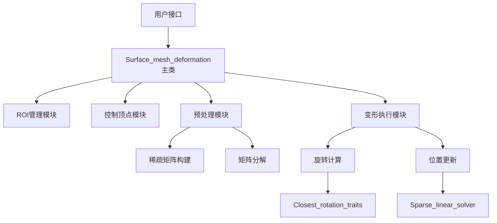

# CGAL Surface_mesh_deformation 技术文档 v1.0

## 目录

1. [包概述](#1-包概述)
2. [算法理论背景](#2-算法理论背景)
3. [核心架构设计](#3-核心架构设计)
4. [主要类和API详解](#4-主要类和api详解)
5. [使用方法和最佳实践](#5-使用方法和最佳实践)
6. [示例代码详解](#6-示例代码详解)
7. [性能考虑和优化](#7-性能考虑和优化)
8. [常见问题和解决方案](#8-常见问题和解决方案)
9. [版本信息和兼容性](#9-版本信息和兼容性)

---

## 1. 包概述

### 1.1 功能介绍

CGAL Surface_mesh_deformation包提供了一个灵活而强大的框架，用于对三角网格进行基于控制点的形状变形。该包实现了As-Rigid-As-Possible（ARAP）变形算法及其变体，允许用户通过操纵少量控制顶点来自然地变形整个网格或其子区域。

### 1.2 主要特性

- **多种变形算法**：支持三种ARAP算法变体
  - ORIGINAL_ARAP：原始ARAP算法
  - SPOKES_AND_RIMS：辐条和轮辋版本
  - SRE_ARAP：平滑旋转增强版本

- **灵活的控制**：
  - 支持任意数量的控制顶点
  - 可定义感兴趣区域（ROI）
  - 支持平移、旋转和目标位置设置

- **高效求解**：
  - 使用稀疏线性系统求解器
  - 支持迭代优化
  - 能量最小化终止准则

- **易于集成**：
  - 模板化设计，支持多种网格数据结构
  - 与CGAL其他组件无缝集成
  - 仅需头文件，无需编译库

### 1.3 应用场景

- **计算机图形学**：角色动画、模型编辑
- **计算机辅助设计**：形状修改、原型设计
- **医学图像处理**：器官形状配准、手术规划
- **虚拟现实**：交互式模型变形
- **游戏开发**：实时角色变形

---

## 2. 算法理论背景

### 2.1 As-Rigid-As-Possible (ARAP) 变形原理

ARAP变形算法的核心思想是在变形过程中尽可能保持局部刚性。算法通过最小化以下能量函数实现：

```
E(V') = Σ_i w_i Σ_j∈N(i) w_ij ||（v'_i - v'_j) - R_i(v_i - v_j)||²
```

其中：
- `V'`：变形后的顶点位置
- `R_i`：顶点i的局部旋转矩阵
- `w_i, w_ij`：权重系数
- `N(i)`：顶点i的邻域

### 2.2 算法变体详解

#### 2.2.1 ORIGINAL_ARAP

原始ARAP算法使用标准的cotangent权重，通过交替优化求解：
1. **固定顶点位置，求解旋转矩阵**：使用SVD或极分解计算最优旋转
2. **固定旋转矩阵，求解顶点位置**：求解稀疏线性系统

#### 2.2.2 SPOKES_AND_RIMS

该变体改进了权重计算方式：
- 使用单个cotangent权重而非双cotangent权重
- 更适合处理边界和尖锐特征
- 计算效率更高

#### 2.2.3 SRE_ARAP (Smooth Rotation Enhanced)

平滑旋转增强版本：
- 添加旋转场平滑项
- 减少旋转矩阵之间的不连续性
- 产生更自然的变形效果

### 2.3 数学基础

#### 2.3.1 Cotangent权重

Cotangent权重定义为：
```
w_ij = (cot α_ij + cot β_ij) / 2
```
其中α和β是边(i,j)对面的两个角。

#### 2.3.2 旋转矩阵计算

最优旋转通过最小化Frobenius范数获得：
```
R_i = argmin_R ||S_i - R||_F
```
其中S_i是协方差矩阵。

---

## 3. 核心架构设计

### 3.1 类层次结构

```
Surface_mesh_deformation<TM, VIM, HIM, TAG, WC, ST, CR, VPM>
    |
    +-- 模板参数
    |   |-- TM: Triangle_mesh (网格类型)
    |   |-- VIM: Vertex_index_map (顶点索引映射)
    |   |-- HIM: Hedge_index_map (半边索引映射)
    |   |-- TAG: Deformation_algorithm_tag (算法标签)
    |   |-- WC: Weight_calculator (权重计算器)
    |   |-- ST: Sparse_linear_solver (稀疏求解器)
    |   |-- CR: Closest_rotation_traits (旋转计算特征)
    |   |-- VPM: Vertex_point_map (顶点点映射)
    |
    +-- 内部组件
        |-- ROI管理器
        |-- 控制顶点管理器
        |-- 线性系统构建器
        |-- 旋转优化器
        |-- 能量计算器
```

### 3.2 数据流架构

```
输入网格
    ↓
ROI选择 → 控制顶点选择
    ↓
预处理（构建线性系统）
    ↓
迭代优化循环
    ├─→ 计算局部旋转
    ├─→ 更新顶点位置
    └─→ 检查收敛条件
    ↓
输出变形网格
```

### 3.3 模块交互



---

## 4. 主要类和API详解

### 4.1 Surface_mesh_deformation类

#### 4.1.1 类声明

```cpp
template<
  class TM,                    // 三角网格类型
  class VIM = Default,         // 顶点索引映射
  class HIM = Default,         // 半边索引映射
  Deformation_algorithm_tag TAG = SPOKES_AND_RIMS,  // 算法标签
  class WC = Default,          // 权重计算器
  class ST = Default,          // 稀疏求解器
  class CR = Default,          // 旋转计算器
  class VPM = Default          // 顶点点映射
>
class Surface_mesh_deformation;
```

#### 4.1.2 核心类型定义

```cpp
// 基本类型
typedef TM Triangle_mesh;
typedef typename boost::graph_traits<TM>::vertex_descriptor vertex_descriptor;
typedef typename boost::graph_traits<TM>::halfedge_descriptor halfedge_descriptor;
typedef typename boost::property_traits<VPM>::value_type Point;

// 容器类型
typedef std::vector<vertex_descriptor> Roi_vertex_range;
```

### 4.2 ROI管理API

#### 4.2.1 插入ROI顶点

```cpp
// 插入单个顶点
bool insert_roi_vertex(vertex_descriptor vd);

// 批量插入顶点
template<class InputIterator>
void insert_roi_vertices(InputIterator begin, InputIterator end);

// 清空ROI
void clear_roi_vertices();

// 删除顶点
bool erase_roi_vertex(vertex_descriptor vd);
```

#### 4.2.2 ROI查询

```cpp
// 获取ROI顶点范围
const Roi_vertex_range& roi_vertices() const;

// 检查顶点是否在ROI中
bool is_roi_vertex(vertex_descriptor vd) const;

// 获取ROI大小
std::size_t number_of_roi_vertices() const;
```

### 4.3 控制顶点管理API

#### 4.3.1 控制顶点操作

```cpp
// 插入控制顶点
bool insert_control_vertex(vertex_descriptor vd);

// 批量插入
template<class InputIterator>
void insert_control_vertices(InputIterator begin, InputIterator end);

// 删除控制顶点
bool erase_control_vertex(vertex_descriptor vd);

// 清空所有控制顶点
void clear_control_vertices();
```

#### 4.3.2 目标位置设置

```cpp
// 设置目标位置
void set_target_position(vertex_descriptor vd, const Point& target);

// 获取目标位置
Point target_position(vertex_descriptor vd) const;

// 批量设置
template<class InputIterator, class PointIterator>
void set_target_positions(InputIterator vbegin, InputIterator vend,
                          PointIterator pbegin);
```

### 4.4 变形操作API

#### 4.4.1 预处理

```cpp
// 预处理（必须在变形前调用）
bool preprocess();

// 检查是否需要预处理
bool is_preprocess_required() const;
```

#### 4.4.2 变形执行

```cpp
// 执行变形（使用默认参数）
void deform();

// 执行变形（指定迭代次数和容差）
void deform(unsigned int iterations, double tolerance);

// 设置迭代参数
void set_iterations(unsigned int iterations);
void set_tolerance(double tolerance);
```

#### 4.4.3 变换操作

```cpp
// 平移控制顶点
template<class InputIterator, class Vector>
void translate(InputIterator begin, InputIterator end, 
               const Vector& translation);

// 旋转控制顶点
template<class InputIterator, class Vector, class Quaternion>
void rotate(InputIterator begin, InputIterator end,
            const Vector& origin, const Quaternion& quat);

// 重置到原始位置
void reset();

// 覆盖原始位置
void overwrite_initial_geometry();
```

### 4.5 旋转计算特征类

#### 4.5.1 Deformation_Eigen_closest_rotation_traits_3

使用SVD计算最近旋转：

```cpp
class Deformation_Eigen_closest_rotation_traits_3 {
public:
    typedef Eigen::Matrix3d Matrix;
    typedef Eigen::Vector3d Vector;
    
    // 计算最近旋转
    void compute_close_rotation(const Matrix& m, Matrix& R);
    
    // 辅助函数
    Matrix identity_matrix();
    Matrix zero_matrix();
    Vector vector(double x, double y, double z);
};
```

#### 4.5.2 Deformation_Eigen_polar_closest_rotation_traits_3

使用极分解计算最近旋转（更快）：

```cpp
class Deformation_Eigen_polar_closest_rotation_traits_3 
    : public Deformation_Eigen_closest_rotation_traits_3 {
public:
    // 使用混合方法：先尝试极分解，失败则回退到SVD
    void compute_close_rotation(const Matrix& m, Matrix& R);
};
```

### 4.6 权重计算器

```cpp
// 单cotangent权重（用于SPOKES_AND_RIMS）
struct Single_cotangent_weight {
    template<class TriangleMesh>
    double operator()(halfedge_descriptor he, 
                     const TriangleMesh& mesh) const;
};

// 双cotangent权重（用于ORIGINAL_ARAP）
struct Cotangent_weight {
    template<class TriangleMesh>
    double operator()(halfedge_descriptor he,
                     const TriangleMesh& mesh) const;
};
```

---

## 5. 使用方法和最佳实践

### 5.1 基本使用流程

#### 5.1.1 初始化步骤

```cpp
// 1. 加载网格
Polyhedron mesh;
std::ifstream input("model.off");
input >> mesh;

// 2. 初始化索引
set_halfedgeds_items_id(mesh);

// 3. 创建变形对象
Surface_mesh_deformation deform_mesh(mesh);

// 4. 设置ROI
vertex_iterator vb, ve;
std::tie(vb, ve) = vertices(mesh);
deform_mesh.insert_roi_vertices(vb, ve);  // 使用整个网格

// 5. 设置控制顶点
vertex_descriptor control_v = *std::next(vb, 100);
deform_mesh.insert_control_vertex(control_v);

// 6. 预处理
if (!deform_mesh.preprocess()) {
    std::cerr << "预处理失败" << std::endl;
    return;
}
```

#### 5.1.2 执行变形

```cpp
// 设置目标位置
Point target(1.0, 2.0, 3.0);
deform_mesh.set_target_position(control_v, target);

// 执行变形
deform_mesh.deform();  // 使用默认参数
// 或
deform_mesh.deform(20, 1e-4);  // 最多20次迭代，容差1e-4
```

### 5.2 高级技巧

#### 5.2.1 选择合适的算法

```cpp
// 对于一般网格，使用SPOKES_AND_RIMS（默认）
typedef Surface_mesh_deformation<Polyhedron, 
    Default, Default, SPOKES_AND_RIMS> Deformer_SR;

// 对于需要严格保持体积的情况，使用ORIGINAL_ARAP
typedef Surface_mesh_deformation<Polyhedron,
    Default, Default, ORIGINAL_ARAP> Deformer_ARAP;

// 对于需要平滑变形的情况，使用SRE_ARAP
typedef Surface_mesh_deformation<Polyhedron,
    Default, Default, SRE_ARAP> Deformer_SRE;
```

#### 5.2.2 K环邻域选择

```cpp
// 提取K环邻域作为ROI
std::vector<vertex_descriptor> extract_k_ring(
    const Polyhedron& P, 
    vertex_descriptor v, 
    int k) 
{
    std::map<vertex_descriptor, int> distances;
    std::vector<vertex_descriptor> queue;
    queue.push_back(v);
    distances[v] = 0;
    
    size_t current = 0;
    while (current < queue.size() && 
           distances[queue[current]] < k) {
        vertex_descriptor curr_v = queue[current++];
        int dist = distances[curr_v];
        
        for (auto e : out_edges(curr_v, P)) {
            vertex_descriptor neighbor = target(halfedge(e, P), P);
            if (distances.insert({neighbor, dist + 1}).second) {
                queue.push_back(neighbor);
            }
        }
    }
    return queue;
}
```

#### 5.2.3 动态更新控制顶点

```cpp
// 初始变形
deform_mesh.set_target_position(v1, pos1);
deform_mesh.deform();

// 添加新的控制顶点（需要重新预处理）
deform_mesh.insert_control_vertex(v2);
if (!deform_mesh.preprocess()) {
    // 处理错误
}

// 继续变形
deform_mesh.set_target_position(v2, pos2);
deform_mesh.deform();
```

#### 5.2.4 组合变换

```cpp
// 先旋转
Eigen::Quaternion<double> rotation(0.92, 0, 0, -0.38);
Vector3d origin(0, 0, 0);
deform_mesh.rotate(controls.begin(), controls.end(), 
                   origin, rotation);

// 再平移
Vector3d translation(1.0, 0.5, 0);
deform_mesh.translate(controls.begin(), controls.end(), 
                      translation);

// 执行变形
deform_mesh.deform();
```

### 5.3 性能优化策略

#### 5.3.1 ROI大小优化

```cpp
// 只选择需要变形的区域，而不是整个网格
std::vector<vertex_descriptor> roi;
// 计算需要变形的顶点
for (vertex_descriptor v : vertices(mesh)) {
    if (distance_to_control(v) < threshold) {
        roi.push_back(v);
    }
}
deform_mesh.insert_roi_vertices(roi.begin(), roi.end());
```

#### 5.3.2 迭代控制

```cpp
// 使用能量阈值提前终止
double tolerance = 1e-3;  // 较大的容差值
unsigned int max_iterations = 10;  // 限制最大迭代次数
deform_mesh.deform(max_iterations, tolerance);

// 分阶段变形
for (int stage = 0; stage < 3; ++stage) {
    // 逐步接近目标
    Point intermediate = interpolate(current, target, 
                                    (stage + 1) / 3.0);
    deform_mesh.set_target_position(control, intermediate);
    deform_mesh.deform(5, 0.01);  // 每阶段少量迭代
}
```

#### 5.3.3 预处理重用

```cpp
class DeformationSession {
    Surface_mesh_deformation deformer;
    bool preprocessed = false;
    
public:
    void setup_roi_and_controls() {
        // 设置ROI和控制顶点
        // ...
        
        if (deformer.preprocess()) {
            preprocessed = true;
        }
    }
    
    void deform_to(const Point& target) {
        if (!preprocessed) {
            throw std::runtime_error("需要先预处理");
        }
        deformer.set_target_position(control, target);
        deformer.deform();
    }
};
```

### 5.4 错误处理

#### 5.4.1 预处理失败处理

```cpp
bool safe_preprocess(Surface_mesh_deformation& deformer) {
    if (!deformer.preprocess()) {
        // 可能的原因：
        // 1. ROI为空
        // 2. 没有控制顶点
        // 3. 矩阵奇异（网格退化）
        
        if (deformer.number_of_roi_vertices() == 0) {
            std::cerr << "错误：ROI为空" << std::endl;
            return false;
        }
        
        if (deformer.number_of_control_vertices() == 0) {
            std::cerr << "错误：没有控制顶点" << std::endl;
            return false;
        }
        
        std::cerr << "错误：矩阵分解失败" << std::endl;
        return false;
    }
    return true;
}
```

#### 5.4.2 数值稳定性

```cpp
// 检查变形结果的有效性
bool validate_deformation(const Polyhedron& mesh) {
    for (auto v : vertices(mesh)) {
        const Point& p = v->point();
        // 检查NaN
        if (std::isnan(p.x()) || std::isnan(p.y()) || 
            std::isnan(p.z())) {
            return false;
        }
        // 检查无穷大
        if (std::isinf(p.x()) || std::isinf(p.y()) || 
            std::isinf(p.z())) {
            return false;
        }
    }
    return true;
}
```

---

## 6. 示例代码详解

### 6.1 基础示例：全网格ROI变形

```cpp
#include <CGAL/Simple_cartesian.h>
#include <CGAL/Polyhedron_3.h>
#include <CGAL/Polyhedron_items_with_id_3.h>
#include <CGAL/Surface_mesh_deformation.h>

typedef CGAL::Simple_cartesian<double> Kernel;
typedef CGAL::Polyhedron_3<Kernel, 
    CGAL::Polyhedron_items_with_id_3> Polyhedron;
typedef CGAL::Surface_mesh_deformation<Polyhedron> 
    Surface_mesh_deformation;

int main() {
    // 1. 加载网格
    Polyhedron mesh;
    std::ifstream input("plane.off");
    input >> mesh;
    
    // 2. 初始化索引（重要！）
    set_halfedgeds_items_id(mesh);
    
    // 3. 创建变形对象
    Surface_mesh_deformation deform_mesh(mesh);
    
    // 4. 设置ROI为整个网格
    vertex_iterator vb, ve;
    std::tie(vb, ve) = vertices(mesh);
    deform_mesh.insert_roi_vertices(vb, ve);
    
    // 5. 选择控制顶点
    vertex_descriptor control_1 = *std::next(vb, 213);
    vertex_descriptor control_2 = *std::next(vb, 157);
    deform_mesh.insert_control_vertex(control_1);
    deform_mesh.insert_control_vertex(control_2);
    
    // 6. 预处理
    if (!deform_mesh.preprocess()) {
        std::cerr << "预处理失败" << std::endl;
        return 1;
    }
    
    // 7. 第一次变形
    Surface_mesh_deformation::Point target1(-0.35, 0.40, 0.60);
    deform_mesh.set_target_position(control_1, target1);
    deform_mesh.deform();
    
    // 8. 第二次变形
    Surface_mesh_deformation::Point target2(0.55, -0.30, 0.70);
    deform_mesh.set_target_position(control_2, target2);
    deform_mesh.deform(10, 0.0);  // 10次迭代，不使用能量终止
    
    // 9. 保存结果
    std::ofstream output("deformed.off");
    output << mesh;
    
    return 0;
}
```

**代码要点**：
- 必须使用`Polyhedron_items_with_id_3`以支持索引
- `set_halfedgeds_items_id`初始化索引是必需的
- 预处理失败时应该处理错误
- 可以多次调用`deform()`进行渐进式变形

### 6.2 高级示例：K环ROI与变换操作

```cpp
// 提取K环邻域函数
std::vector<vertex_descriptor> extract_k_ring(
    const Polyhedron& P, 
    vertex_descriptor v, 
    int k) 
{
    std::map<vertex_descriptor, int> D;
    std::vector<vertex_descriptor> Q;
    Q.push_back(v);
    D[v] = 0;
    
    size_t current_index = 0;
    int dist_v;
    
    while (current_index < Q.size() && 
           (dist_v = D[Q[current_index]]) < k) {
        v = Q[current_index++];
        
        for (edge_descriptor e : out_edges(v, P)) {
            halfedge_descriptor he = halfedge(e, P);
            vertex_descriptor new_v = target(he, P);
            if (D.insert(std::make_pair(new_v, dist_v + 1)).second) {
                Q.push_back(new_v);
            }
        }
    }
    return Q;
}

int main() {
    Polyhedron mesh;
    std::ifstream input("plane.off");
    input >> mesh;
    
    set_halfedgeds_items_id(mesh);
    Surface_mesh_deformation deform_mesh(mesh);
    
    // 使用K环选择ROI
    vertex_iterator vb, ve;
    std::tie(vb, ve) = vertices(mesh);
    std::vector<vertex_descriptor> roi = 
        extract_k_ring(mesh, *std::next(vb, 47), 9);
    deform_mesh.insert_roi_vertices(roi.begin(), roi.end());
    
    // 选择两组控制顶点
    std::vector<vertex_descriptor> controls_1 = 
        extract_k_ring(mesh, *std::next(vb, 39), 1);
    std::vector<vertex_descriptor> controls_2 = 
        extract_k_ring(mesh, *std::next(vb, 97), 1);
    
    deform_mesh.insert_control_vertices(controls_1.begin(), 
                                        controls_1.end());
    deform_mesh.insert_control_vertices(controls_2.begin(), 
                                        controls_2.end());
    
    // 应用旋转变换
    Eigen::Quaternion<double> quat(0.92, 0, 0, -0.38);
    Eigen::Vector3d origin(0, 0, 0);
    
    deform_mesh.rotate(controls_1.begin(), controls_1.end(), 
                      origin, quat);
    deform_mesh.rotate(controls_2.begin(), controls_2.end(), 
                      origin, quat);
    
    // 执行变形
    deform_mesh.deform();
    
    // 保存第一次变形结果
    std::ofstream output("rotation_deform.off");
    output << mesh;
    
    // 重置并应用平移
    deform_mesh.reset();
    
    Eigen::Vector3d translation(0, 0.3, 0);
    deform_mesh.translate(controls_1.begin(), controls_1.end(), 
                         translation);
    deform_mesh.translate(controls_2.begin(), controls_2.end(), 
                         translation);
    
    // 设置参数并变形
    deform_mesh.set_iterations(10);
    deform_mesh.set_tolerance(0.0);
    deform_mesh.deform();
    
    // 保存第二次变形结果
    output.open("translation_deform.off");
    output << mesh;
    
    return 0;
}
```

**代码要点**：
- K环选择允许局部控制变形范围
- 可以对控制顶点组应用变换
- `reset()`恢复到原始几何
- 参数可以通过setter方法设置

### 6.3 实用示例：交互式变形会话

```cpp
class InteractiveDeformationSession {
private:
    Polyhedron mesh;
    Surface_mesh_deformation deformer;
    std::vector<vertex_descriptor> control_vertices;
    bool is_preprocessed;
    
public:
    InteractiveDeformationSession(const std::string& filename) 
        : deformer(mesh), is_preprocessed(false) {
        // 加载网格
        std::ifstream input(filename);
        if (!input || !(input >> mesh)) {
            throw std::runtime_error("无法加载网格");
        }
        set_halfedgeds_items_id(mesh);
    }
    
    // 设置变形区域
    void setup_roi(vertex_descriptor center, int ring_size) {
        deformer.clear_roi_vertices();
        auto roi = extract_k_ring(mesh, center, ring_size);
        deformer.insert_roi_vertices(roi.begin(), roi.end());
        is_preprocessed = false;
    }
    
    // 添加控制点
    void add_control_point(vertex_descriptor v) {
        if (deformer.insert_control_vertex(v)) {
            control_vertices.push_back(v);
            is_preprocessed = false;
        }
    }
    
    // 准备变形
    bool prepare() {
        if (is_preprocessed) return true;
        
        if (deformer.preprocess()) {
            is_preprocessed = true;
            return true;
        }
        return false;
    }
    
    // 交互式拖动
    void drag_control_point(vertex_descriptor v, 
                           const Point& new_position) {
        if (!is_preprocessed && !prepare()) {
            throw std::runtime_error("预处理失败");
        }
        
        deformer.set_target_position(v, new_position);
        deformer.deform(5, 0.001);  // 快速响应
    }
    
    // 平滑变形到目标
    void smooth_deform_to(
        const std::map<vertex_descriptor, Point>& targets,
        int steps = 10) {
        if (!is_preprocessed && !prepare()) {
            throw std::runtime_error("预处理失败");
        }
        
        // 获取当前位置
        std::map<vertex_descriptor, Point> current;
        for (const auto& [v, target] : targets) {
            current[v] = mesh.point(v);
        }
        
        // 渐进式变形
        for (int step = 1; step <= steps; ++step) {
            double t = static_cast<double>(step) / steps;
            
            for (const auto& [v, target] : targets) {
                Point interpolated = current[v] + 
                    t * (target - current[v]);
                deformer.set_target_position(v, interpolated);
            }
            
            deformer.deform(3, 0.001);
        }
    }
    
    // 保存当前状态
    void save(const std::string& filename) {
        std::ofstream output(filename);
        output << mesh;
    }
    
    // 撤销变形
    void undo() {
        deformer.reset();
    }
    
    // 应用变形（覆盖原始几何）
    void commit() {
        deformer.overwrite_initial_geometry();
    }
};

// 使用示例
int main() {
    try {
        InteractiveDeformationSession session("model.off");
        
        // 设置变形区域
        vertex_iterator vb, ve;
        std::tie(vb, ve) = vertices(session.get_mesh());
        vertex_descriptor center = *std::next(vb, 100);
        session.setup_roi(center, 5);
        
        // 添加控制点
        session.add_control_point(*std::next(vb, 50));
        session.add_control_point(*std::next(vb, 150));
        
        // 准备变形
        if (!session.prepare()) {
            std::cerr << "准备失败" << std::endl;
            return 1;
        }
        
        // 模拟交互式拖动
        Point target1(1.0, 2.0, 3.0);
        session.drag_control_point(*std::next(vb, 50), target1);
        
        // 平滑变形
        std::map<vertex_descriptor, Point> targets;
        targets[*std::next(vb, 50)] = Point(2.0, 3.0, 4.0);
        targets[*std::next(vb, 150)] = Point(-1.0, 0.0, 1.0);
        session.smooth_deform_to(targets);
        
        // 保存结果
        session.save("deformed_interactive.off");
        
    } catch (const std::exception& e) {
        std::cerr << "错误: " << e.what() << std::endl;
        return 1;
    }
    
    return 0;
}
```

---

## 7. 性能考虑和优化

### 7.1 时间复杂度分析

| 操作 | 时间复杂度 | 说明 |
|------|-----------|------|
| 预处理 | O(n²) | n为ROI顶点数，主要是矩阵分解 |
| 单次迭代 | O(n·m) | m为平均顶点度数 |
| 旋转计算 | O(n) | 每个顶点独立计算 |
| 线性求解 | O(n·k) | k为矩阵非零元素数 |

### 7.2 空间复杂度

- **稀疏矩阵存储**：O(n·m)，其中m为平均顶点度数
- **旋转矩阵缓存**：O(n)，每个ROI顶点一个3×3矩阵
- **临时变量**：O(n)，用于迭代计算

### 7.3 性能优化建议

#### 7.3.1 算法选择

```cpp
// 性能对比
// SPOKES_AND_RIMS: 最快，内存占用最少
// ORIGINAL_ARAP: 中等速度，更好的体积保持
// SRE_ARAP: 最慢，最平滑的结果

// 根据需求选择
template<Deformation_algorithm_tag TAG>
using Deformer = Surface_mesh_deformation<
    Polyhedron, Default, Default, TAG>;

// 实时应用
Deformer<SPOKES_AND_RIMS> fast_deformer(mesh);

// 高质量离线处理
Deformer<SRE_ARAP> quality_deformer(mesh);
```

#### 7.3.2 ROI优化

```cpp
// 使用距离阈值限制ROI大小
class AdaptiveROI {
    static std::vector<vertex_descriptor> 
    compute_roi(const Polyhedron& mesh,
                const std::vector<vertex_descriptor>& controls,
                double influence_radius) {
        std::vector<vertex_descriptor> roi;
        
        for (auto v : vertices(mesh)) {
            double min_dist = std::numeric_limits<double>::max();
            
            for (auto c : controls) {
                double dist = compute_geodesic_distance(v, c, mesh);
                min_dist = std::min(min_dist, dist);
            }
            
            if (min_dist <= influence_radius) {
                roi.push_back(v);
            }
        }
        
        return roi;
    }
};
```

#### 7.3.3 多分辨率策略

```cpp
class MultiResolutionDeformation {
    std::vector<Polyhedron> levels;  // 不同分辨率的网格
    
public:
    void build_hierarchy(const Polyhedron& original, int levels) {
        this->levels.push_back(original);
        
        for (int i = 1; i < levels; ++i) {
            Polyhedron simplified;
            // 使用网格简化算法
            simplify_mesh(this->levels.back(), simplified, 0.5);
            this->levels.push_back(simplified);
        }
    }
    
    void deform_hierarchical(/* 参数 */) {
        // 从粗到细进行变形
        for (int i = levels.size() - 1; i >= 0; --i) {
            Surface_mesh_deformation deformer(levels[i]);
            // 设置和变形
            // ...
            
            if (i > 0) {
                // 将变形传播到下一级
                propagate_deformation(levels[i], levels[i-1]);
            }
        }
    }
};
```

### 7.4 内存优化

#### 7.4.1 稀疏矩阵配置

```cpp
// 使用自定义求解器配置
#include <CGAL/Eigen_solver_traits.h>
#include <Eigen/IterativeLinearSolvers>

// 使用迭代求解器节省内存
typedef CGAL::Eigen_solver_traits<
    Eigen::ConjugateGradient<
        CGAL::Eigen_sparse_matrix<double>::EigenType>> 
    IterativeSolver;

typedef Surface_mesh_deformation<
    Polyhedron, Default, Default, SPOKES_AND_RIMS,
    Default, IterativeSolver> MemoryEfficientDeformer;
```

#### 7.4.2 按需计算

```cpp
class LazyDeformation {
    Surface_mesh_deformation* deformer = nullptr;
    Polyhedron& mesh;
    
public:
    LazyDeformation(Polyhedron& m) : mesh(m) {}
    
    ~LazyDeformation() {
        delete deformer;
    }
    
    void initialize_when_needed() {
        if (!deformer) {
            deformer = new Surface_mesh_deformation(mesh);
            // 设置ROI和控制顶点
        }
    }
    
    void deform() {
        initialize_when_needed();
        deformer->deform();
    }
};
```

### 7.5 并行化考虑

虽然当前实现主要是串行的，但某些部分可以并行化：

```cpp
// 旋转计算可以并行
#include <execution>
#include <algorithm>

void parallel_rotation_computation(
    std::vector<Matrix3d>& rotations,
    const std::vector<Matrix3d>& covariances) {
    
    std::transform(std::execution::par_unseq,
                  covariances.begin(), covariances.end(),
                  rotations.begin(),
                  [](const Matrix3d& S) {
                      Matrix3d R;
                      compute_closest_rotation(S, R);
                      return R;
                  });
}
```

---

## 8. 常见问题和解决方案

### 8.1 预处理失败

**问题**：`preprocess()`返回false

**可能原因和解决方案**：

```cpp
bool diagnose_preprocess_failure(Surface_mesh_deformation& deformer) {
    // 1. 检查ROI
    if (deformer.number_of_roi_vertices() == 0) {
        std::cerr << "错误：ROI为空，请先插入ROI顶点" << std::endl;
        return false;
    }
    
    // 2. 检查控制顶点
    if (deformer.number_of_control_vertices() == 0) {
        std::cerr << "错误：没有控制顶点" << std::endl;
        return false;
    }
    
    // 3. 检查控制顶点是否在ROI中
    for (auto cv : deformer.control_vertices()) {
        if (!deformer.is_roi_vertex(cv)) {
            std::cerr << "错误：控制顶点不在ROI中" << std::endl;
            return false;
        }
    }
    
    // 4. 检查网格连通性
    // ...
    
    return true;
}
```

### 8.2 变形结果不自然

**问题**：变形后出现扭曲或折叠

**解决方案**：

```cpp
// 1. 调整算法参数
deformer.set_iterations(20);  // 增加迭代次数
deformer.set_tolerance(1e-5);  // 减小容差

// 2. 使用不同的算法
typedef Surface_mesh_deformation<Polyhedron, 
    Default, Default, SRE_ARAP> SmoothDeformer;

// 3. 增加控制顶点密度
void add_intermediate_controls(
    Surface_mesh_deformation& deformer,
    vertex_descriptor v1, vertex_descriptor v2) {
    // 在v1和v2之间添加控制顶点
    auto path = compute_shortest_path(v1, v2);
    for (size_t i = 1; i < path.size() - 1; i += 2) {
        deformer.insert_control_vertex(path[i]);
    }
}
```

### 8.3 性能问题

**问题**：变形速度太慢

**优化策略**：

```cpp
class PerformanceOptimizer {
public:
    // 1. 减少ROI大小
    static void optimize_roi(Surface_mesh_deformation& deformer,
                            double reduction_factor = 0.5) {
        auto roi = deformer.roi_vertices();
        size_t new_size = roi.size() * reduction_factor;
        
        // 保留离控制顶点最近的顶点
        // ...
    }
    
    // 2. 使用较少的迭代次数
    static void fast_deform(Surface_mesh_deformation& deformer) {
        deformer.set_iterations(3);
        deformer.set_tolerance(0.01);
        deformer.deform();
    }
    
    // 3. 分级变形
    static void hierarchical_deform(
        Surface_mesh_deformation& deformer,
        const Point& target,
        vertex_descriptor control) {
        
        Point current = deformer.target_position(control);
        
        // 粗略变形
        Point mid = current + 0.5 * (target - current);
        deformer.set_target_position(control, mid);
        deformer.deform(2, 0.1);
        
        // 精细变形
        deformer.set_target_position(control, target);
        deformer.deform(5, 0.01);
    }
};
```

### 8.4 数值不稳定

**问题**：出现NaN或无穷大值

**诊断和修复**：

```cpp
class NumericalStabilizer {
public:
    static bool check_mesh_validity(const Polyhedron& mesh) {
        for (auto v : vertices(mesh)) {
            const auto& p = mesh.point(v);
            if (!is_finite(p)) {
                return false;
            }
        }
        return true;
    }
    
    static void stabilize_deformation(
        Surface_mesh_deformation& deformer) {
        // 1. 使用更稳定的旋转计算
        // 选择极分解而不是SVD
        
        // 2. 限制变形幅度
        clamp_deformation_magnitude(deformer);
        
        // 3. 增加正则化
        add_regularization_term(deformer);
    }
    
private:
    static bool is_finite(const Point& p) {
        return std::isfinite(p.x()) && 
               std::isfinite(p.y()) && 
               std::isfinite(p.z());
    }
    
    static void clamp_deformation_magnitude(
        Surface_mesh_deformation& deformer) {
        // 限制目标位置与原始位置的距离
        const double max_displacement = 10.0;
        
        for (auto cv : deformer.control_vertices()) {
            Point original = deformer.initial_position(cv);
            Point target = deformer.target_position(cv);
            
            Vector displacement = target - original;
            double length = std::sqrt(displacement.squared_length());
            
            if (length > max_displacement) {
                Point clamped = original + 
                    (max_displacement / length) * displacement;
                deformer.set_target_position(cv, clamped);
            }
        }
    }
};
```

### 8.5 内存不足

**问题**：处理大型网格时内存溢出

**解决方案**：

```cpp
// 1. 使用流式处理
class StreamingDeformation {
    void process_large_mesh(const std::string& input_file,
                           const std::string& output_file) {
        // 分块读取和处理
        // ...
    }
};

// 2. 使用外部内存算法
class OutOfCoreDeformation {
    void setup_external_solver() {
        // 配置使用磁盘的求解器
        // ...
    }
};

// 3. 网格简化预处理
class SimplificationPreprocess {
    Polyhedron simplify_for_deformation(
        const Polyhedron& original,
        double target_reduction = 0.1) {
        
        Polyhedron simplified;
        // 使用边折叠简化
        // ...
        return simplified;
    }
};
```

---

## 9. 版本信息和兼容性

### 9.1 版本历史

| 版本 | 发布日期 | 主要更新 |
|------|---------|----------|
| 4.5 | 2014 | 首次引入Surface_mesh_deformation包 |
| 4.7 | 2015 | 添加SRE_ARAP算法 |
| 4.9 | 2016 | 性能优化，改进预处理 |
| 5.0 | 2019 | 转为仅头文件库 |
| 5.3 | 2021 | 支持更多网格类型 |
| 5.5 | 2022 | 改进数值稳定性 |
| 6.0 | 2024 | 现代C++更新 |

### 9.2 依赖要求

#### 必需依赖
- **C++14或更高版本**
- **Eigen 3.3或更高版本**（用于线性代数计算）
- **CGAL核心组件**

#### 可选依赖
- **Intel MKL**：加速线性求解
- **OpenMP**：并行计算支持
- **Qt5**：可视化演示

### 9.3 编译配置

```cmake
# CMakeLists.txt 示例
cmake_minimum_required(VERSION 3.12)
project(SurfaceDeformationApp)

# 设置C++标准
set(CMAKE_CXX_STANDARD 14)
set(CMAKE_CXX_STANDARD_REQUIRED ON)

# 查找CGAL
find_package(CGAL REQUIRED)

# 查找Eigen
find_package(Eigen3 3.3 REQUIRED NO_MODULE)

# 创建可执行文件
add_executable(deform_app main.cpp)

# 链接库
target_link_libraries(deform_app 
    CGAL::CGAL 
    Eigen3::Eigen)

# 优化选项
if(CMAKE_BUILD_TYPE STREQUAL "Release")
    target_compile_options(deform_app PRIVATE -O3 -march=native)
endif()
```

### 9.4 平台兼容性

| 平台 | 编译器 | 状态 | 备注 |
|------|--------|------|------|
| Linux | GCC 7+ | ✅ 完全支持 | 推荐平台 |
| Linux | Clang 6+ | ✅ 完全支持 | |
| Windows | MSVC 2017+ | ✅ 完全支持 | 需要/bigobj |
| macOS | Apple Clang | ✅ 完全支持 | |
| Windows | MinGW | ⚠️ 部分支持 | 可能有性能问题 |

### 9.5 与其他CGAL组件的集成

```cpp
// 与Polygon_mesh_processing集成
#include <CGAL/Polygon_mesh_processing/refine.h>
#include <CGAL/Polygon_mesh_processing/repair.h>

void preprocess_mesh_for_deformation(Polyhedron& mesh) {
    // 修复网格
    PMP::remove_degenerate_faces(mesh);
    PMP::remove_isolated_vertices(mesh);
    
    // 细化网格以获得更好的变形质量
    PMP::refine(mesh, faces(mesh),
                CGAL::parameters::density_control_factor(2.0));
}

// 与Surface_mesh集成
#include <CGAL/Surface_mesh.h>

typedef CGAL::Surface_mesh<Point> Surface_mesh;
typedef CGAL::Surface_mesh_deformation<Surface_mesh> SM_Deformation;
```

### 9.6 未来发展方向

- **GPU加速**：使用CUDA/OpenCL加速计算
- **机器学习集成**：基于学习的变形预测
- **实时反馈**：改进交互响应速度
- **物理仿真**：集成弹性和塑性变形
- **拓扑变化**：支持变形中的拓扑修改

---

## 附录A：API快速参考

### 构造函数和基本操作
```cpp
Surface_mesh_deformation(Triangle_mesh& tm);
bool preprocess();
void deform();
void deform(unsigned int iterations, double tolerance);
void reset();
void overwrite_initial_geometry();
```

### ROI管理
```cpp
bool insert_roi_vertex(vertex_descriptor vd);
template<class InputIterator>
void insert_roi_vertices(InputIterator begin, InputIterator end);
bool erase_roi_vertex(vertex_descriptor vd);
void clear_roi_vertices();
std::size_t number_of_roi_vertices() const;
```

### 控制顶点管理
```cpp
bool insert_control_vertex(vertex_descriptor vd);
bool erase_control_vertex(vertex_descriptor vd);
void clear_control_vertices();
std::size_t number_of_control_vertices() const;
```

### 变换操作
```cpp
void set_target_position(vertex_descriptor vd, const Point& pos);
template<class InputIterator, class Vector>
void translate(InputIterator begin, InputIterator end, const Vector& t);
template<class InputIterator, class Vector, class Quaternion>
void rotate(InputIterator begin, InputIterator end, 
           const Vector& origin, const Quaternion& q);
```

## 附录B：常用代码模板

### 基础变形模板
```cpp
template<typename Mesh>
class BasicDeformationTemplate {
    typedef CGAL::Surface_mesh_deformation<Mesh> Deformer;
    
    Mesh& mesh;
    std::unique_ptr<Deformer> deformer;
    
public:
    BasicDeformationTemplate(Mesh& m) : mesh(m) {
        deformer = std::make_unique<Deformer>(mesh);
    }
    
    bool setup(/* 参数 */) {
        // ROI和控制顶点设置
        // ...
        return deformer->preprocess();
    }
    
    void deform(/* 参数 */) {
        // 变形逻辑
        // ...
    }
};
```

### 错误处理模板
```cpp
template<typename Deformer>
class SafeDeformation {
    static bool safe_execute(Deformer& d, 
                            std::function<void(Deformer&)> operation) {
        try {
            operation(d);
            return true;
        } catch (const std::exception& e) {
            std::cerr << "变形错误: " << e.what() << std::endl;
            return false;
        }
    }
};
```

---

## 文档元信息

- **文档版本**: v1.0
- **创建日期**: 2025年1月
- **适用版本**: CGAL 5.0及以上
- **作者**: CGAL开发团队
- **最后更新**: 2025年1月

## 参考文献

1. Sorkine, O., & Alexa, M. (2007). As-rigid-as-possible surface modeling. *Symposium on Geometry Processing*.
2. Bouaziz, S., et al. (2014). Projective dynamics: fusing constraint projections for fast simulation. *ACM Transactions on Graphics*.
3. CGAL User and Reference Manual. https://doc.cgal.org/
4. Eigen Documentation. http://eigen.tuxfamily.org/